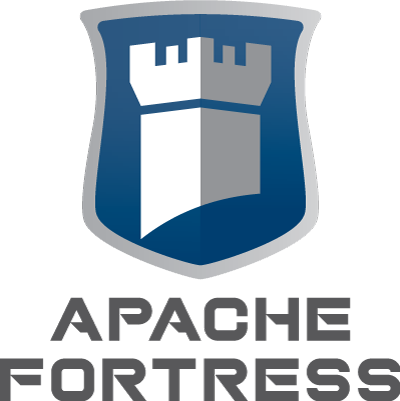

-------------------------------------------------------------------------------
# Overview of the apache-fortress-quickstart

 * This sample shows how to interact with Apache Fortress APIs using REST via command-line invocations w/ curl.
 * It shows how to install Apache Fortress Rest component into an Apache Tomcat server instance and connect to a properly configured LDAP server.
 * The samples load a fictional security policy that correspond with another fortress sample called the [rbac-abac-sample](https://github.com/shawnmckinney/rbac-abac-sample).

-------------------------------------------------------------------------------
## Table of Contents
 * Prerequisites
 * SECTION 1. Prepare an LDAP Server
 * SECTION 2. Prepare Tomcat for Java EE Security
 * SECTION 3. Prepare apache-fortress-quickstart package
 * SECTION 4. Configure Apache Tomcat and Deploy Apache Fortress Rest
 * SECTION 5. Test Apache Fortress Rest with Curl
 * SECTION 6. Understand the Security Model of Apache Fortress Rest
 * SECTION 7. Understand the Security Policy of the Test Samples

-------------------------------------------------------------------------------
## Prerequisites
1. Java 8
2. Apache Maven 3++, to run the fortress load utility, to bootstrap server data.
3. Apache Tomcat 7++, to host the services.
4. Docker, to host the LDAP server.
5. Curl, to invoke/test fortress.

-------------------------------------------------------------------------------
## SECTION 1. Prepare an LDAP Server

 You may use the ApacheFortress Docker images for either OpenLDAP or ApacheDS:

 Option A: Pull the OpenLDAP prebuilt image:

 ```
 docker pull apachedirectory/openldap-for-apache-fortress-tests
 ```

 Run the OpenLDAP docker container:

 ```
 CONTAINER_ID=$(docker run -d -P apachedirectory/openldap-for-apache-fortress-tests)
 CONTAINER_PORT=$(docker inspect --format='{{(index (index .NetworkSettings.Ports "389/tcp") 0).HostPort}}' $CONTAINER_ID)
 echo $CONTAINER_PORT
 ```

 -- Or --

 Option B: Pull the ApacheDS prebuilt image:

 ```
 docker pull apachedirectory/apacheds-for-apache-fortress-tests
 ```

 Run the ApacheDS docker container:

 ```
 CONTAINER_ID=$(docker run -d -P apachedirectory/apacheds-for-apache-fortress-tests)
 CONTAINER_PORT=$(docker inspect --format='{{(index (index .NetworkSettings.Ports "10389/tcp") 0).HostPort}}' $CONTAINER_ID)
 echo $CONTAINER_PORT
 ```

 *note: make note of the port as it's needed later
 *depending on your docker setup may need to run as root or sudo priv's.

-------------------------------------------------------------------------------
## SECTION 2. Prepare Tomcat for Java EE Security

Apache Fortress Rest uses Java EE security for basic authentication and coarse-grained authorization.

#### 1. Download the fortress realm proxy jar into tomcat/lib folder:

  ```bash
  wget http://repo.maven.apache.org/maven2/org/apache/directory/fortress/fortress-realm-proxy/[VERSION]/fortress-realm-proxy-[VERSION].jar -P $TOMCAT_HOME/lib
  ```

 * Where *$TOMCAT_HOME* points to the execution and *[VERSION]* is current version of Fortress Realm component, as of today, *2.0.3*.

#### 2. Restart tomcat so it can pick up the new jar file on its system classpath.

-------------------------------------------------------------------------------
## SECTION 3. Prepare apache-fortress-quickstart package

#### 1. Stage the project.

 a. Download and extract from Github:

 ```bash
 wget https://github.com/shawnmckinney/apache-fortress-quickstart/archive/master.zip
 ```

 -- Or --

 b. Or `git clone` locally:

 ```git
 git clone https://github.com/shawnmckinney/apache-fortress-quickstart.git
 ```

#### 2. Change directory into it:

 ```bash
 cd apache-fortress-quickstart
 ```

#### 3. Enable an LDAP server:

 a. Copy the example:

 ```bash
 cp src/main/resources/fortress.properties.example src/main/resources/fortress.properties
 ```

 b. Edit the file:

 ```bash
 vi src/main/resources/fortress.properties
 ```

 Pick either Apache Directory or OpenLDAP server:

 c. Prepare fortress for OpenLDAP usage:

 ```properties
 # This param tells fortress what type of ldap server in use:
 ldap.server.type=openldap

 # Use value from [Set Hostname Entry]:
 host=localhost

 # OpenLDAP defaults to this, natively:
 # port=389
 # OpenLDAP in Docker defaults to this:
 port=32768

 # These credentials are used for read/write access to all nodes under suffix:
 admin.user=cn=Manager,dc=example,dc=com
 admin.pw=secret
 ```

  -- Or --

 d. Prepare fortress for ApacheDS usage:

 ```properties
 # This param tells fortress what type of ldap server in use:
 ldap.server.type=apacheds

 # Use value from [Set Hostname Entry]:
 host=localhost

 # ApacheDS in Docker defaults to this:
 port=32768

 # These credentials are used for read/write access to all nodes under suffix:
 admin.user=uid=admin,ou=system
 admin.pw=secret
 ```

 * These values will work with the defaults, set within the Docker images.  You may need to change the port, to match what's currently being used.
 * If pointing to an existing LDAP server impl, change the coordinates accordingly.

#### 4. Verify the java and maven home env variables are set.

 ```maven
 mvn -version
 ```

 This sample requires Java 8 and Maven 3 to be setup within the execution env.

#### 5. Load security policy and configuration data into LDAP for Quickstart testing:

 a. Fortress Bootstrap creates the Directory Information Tree (DIT) structure and adds configuration parameters:

  ```maven
 mvn install -Dload.file=./src/main/resources/FortressBootstrap.xml
  ```

 b. The Fortress Rest Server Policy sets up a service account to have access to Apache Fortress Rest component:

  ```maven
 mvn install -Dload.file=./src/main/resources/FortressRestServerPolicy.xml
  ```

 Build Notes:
 * `-Dload.file` loads this file's data, [FortressRestServerPolicy](src/main/resources/FortressRestServerPolicy.xml), into ldap.
 * `-Dtenenat` can be used to specifies a tenant (subtree) being processed.

___________________________________________________________________________________
## SECTION 4. Configure Apache Tomcat and Deploy Apache Fortress Rest

Set the java system properties in tomcat with the target ldap server's coordinates.

#### 1. Edit the startup script for Tomcat

#### 2. Set the java opts

 a. For OpenLDAP:

 ```
 JAVA_OPTS="-Dfortress.host=localhost -Dfortress.port=32768 -Dfortress.admin.user=cn=manager,dc=example,dc=com -Dfortress.admin.pw='secret' -Dfortress.min.admin.conn=1 -Dfortress.max.admin.conn=10 -Dfortress.ldap.server.type=openldap -Dfortress.enable.ldap.ssl=false -Dfortress.config.realm=DEFAULT -Dfortress.config.root=ou=config,dc=example,dc=com"
 ```

 b. For ApacheDS:

 ```
 JAVA_OPTS="-Dfortress.host=$HOSTNAME -Dfortress.port=32768 -Dfortress.admin.user=uid=admin,ou=system -Dfortress.admin.pw='secret' -Dfortress.min.admin.conn=1 -Dfortress.max.admin.conn=10 -Dfortress.ldap.server.type=apacheds -Dfortress.enable.ldap.ssl=false -Dfortress.config.realm=DEFAULT -Dfortress.config.root=ou=config,dc=example,dc=com"
 ```

##### Notes on JAVA_OPTS
 * The prepacked .war pull down from maven uses java options to point to a particular Apache Fortress LDAP server.
 * These values will work with the defaults, set within the Docker images.  You may need to change the port, to match what's currently being used.

#### 3. Verify these settings match your target LDAP server.

#### 4. Download the fortress rest war into tomcat/webapps folder:

  ```bash
  wget http://repo.maven.apache.org/maven2/org/apache/directory/fortress/fortress-rest/[VERSION]/fortress-rest-[VERSION].war -P $TOMCAT_HOME/webapps
  ```

  * Where *TOMCAT_HOME* matches your target env and *[VERSION]* is latest Fortress Rest Component, as of today *2.0.3*.

___________________________________________________________________________________
## SECTION 5. Test Apache Fortress Rest with Curl

### Services are documented:

 * [Apache Fortress Service API Reference Guide](http://static.javadoc.io/org.apache.directory.fortress/fortress-rest/2.0.3/org/apache/directory/fortress/rest/FortressServiceImpl.html)


### Test Instructions

 * Install curl on local machine.
 * Run these curl commands from src/test/resources folder, where the request xml files are located (or path them in).
 * Use service credentials userId = 'adminuser', password = '$3cret'.  , per what was loaded as policy on earlier step.
 * You will be prompted to enter the password after the curl command is entered.  These credentials form an HTTP Basic Auth Header forwarded to server, validated by Apache Fortress Realm.
 * Replace *[VERSION]* with current version of Fortress Rest component deployed, as of today, *2.0.3*.
 * To target a particular tenant, or subtree, pass via the contextId, for example, specify tneant of `Client123`:
 ```
 <FortRequest>
    <contextId>Client123</contextId>
    ...
 </FortRequest>
 ```

#### 1. Add Role:

 ```
 curl -X POST -u 'adminuser' -H 'Content-type: text/xml' -k -d @test-add-role-bankuser.xml http://localhost:8080/fortress-rest-[VERSION]/roleAdd
 curl -X POST -u 'adminuser' -H 'Content-type: text/xml' -k -d @test-add-role-teller.xml http://localhost:8080/fortress-rest-[VERSION]/roleAdd
 curl -X POST -u 'adminuser' -H 'Content-type: text/xml' -k -d @test-add-role-washer.xml http://localhost:8080/fortress-rest-[VERSION]/roleAdd
 ```

##### Sample request add role bank_users

 ```
 <FortRequest>
      <contextId>HOME</contextId>
      <entity xsi:type="role" xmlns:xsi="http://www.w3.org/2001/XMLSchema-instance">
         <name>Bank_Users</name>
         <description>Test Role for Bank Users in Fortress RBAC-ABAC Demo.</description>
      </entity>
 </FortRequest>
 ```

#### 2. Enable Role Constraint:

 ```
 curl -X POST -u 'adminuser' -H 'Content-type: text/xml' -k -d @test-enable-role-tellers-constraint-locale.xml http://localhost:8080/fortress-rest-[VERSION]/roleEnableConstraint
 curl -X POST -u 'adminuser' -H 'Content-type: text/xml' -k -d @test-enable-role-washers-constraint-locale.xml http://localhost:8080/fortress-rest-[VERSION]/roleEnableConstraint
 ```

##### Sample request to constrain role Tellers by locale:

 ```
 <FortRequest>
 	<contextId>HOME</contextId>
 	<entity xsi:type="role" xmlns:xsi="http://www.w3.org/2001/XMLSchema-instance">
 		<name>tellers</name>
 	</entity>
 	<entity2 xsi:type="roleConstraint" xmlns:xsi="http://www.w3.org/2001/XMLSchema-instance">
 		<key>locale</key>
         <type>NA</type>
 	</entity2>
 </FortRequest>
 ```

#### 3. Search Role:

 ```
 curl -X POST -u 'adminuser' -H 'Content-type: text/xml' -k -d @test-search-role.xml http://localhost:8080/fortress-rest-[VERSION]/roleSearch
 ```

##### Sample request will pull back all roles

 ```
 <FortRequest>
    <contextId>HOME</contextId>
    <value></value>
 </FortRequest>
 ```


#### 4. Add Dynamic Separation of Duty Policy

 ```
 curl -X POST -u 'adminuser' -H 'Content-type: text/xml' -k -d @test-add-dsd-policy-banksafe.xml http://localhost:8080/fortress-rest-[VERSION]/dsdAdd
 ```

##### Sample request prevent Teller and Washer roles from being activated together into a session.

 ```
 <FortRequest>
   <contextId>HOME</contextId>
   <entity xsi:type="sdset" xmlns:xsi="http://www.w3.org/2001/XMLSchema-instance">
       <name>banksafe</name>
       <description>User may only activate one of these roles</description>
       <cardinality>2</cardinality>
       <members>tellers</members>
       <members>washers</members>
   </entity>
 </FortRequest>
 ```

#### 5. Add User:

 ```
 curl -X POST -u 'adminuser' -H 'Content-type: text/xml' -k -d @test-add-user-curly.xml http://localhost:8080/fortress-rest-[VERSION]/userAdd
 curl -X POST -u 'adminuser' -H 'Content-type: text/xml' -k -d @test-add-user-moe.xml http://localhost:8080/fortress-rest-[VERSION]/userAdd
 curl -X POST -u 'adminuser' -H 'Content-type: text/xml' -k -d @test-add-user-larry.xml http://localhost:8080/fortress-rest-[VERSION]/userAdd
 ```

##### Sample request add Curly:

 ```
 <FortRequest>
      <contextId>HOME</contextId>
      <entity xsi:type="user" xmlns:xsi="http://www.w3.org/2001/XMLSchema-instance">
         <userId>curly</userId>
         <description>curly is a test user</description>
         <ou>default</ou>
         <sn>horowitz</sn>
         <cn>curly horowitz</cn>
      </entity>
 </FortRequest>
 ```

#### 6. Search Users:

 ```
 curl -X POST -u 'adminuser' -H 'Content-type: text/xml' -k -d @test-search-user.xml http://localhost:8080/fortress-rest-[VERSION]/userSearch
 ```

##### Sample request pull back all users

 ```
 <FortRequest>
    <entity xsi:type="user" xmlns:xsi="http://www.w3.org/2001/XMLSchema-instance">
        <userId>adminuser</userId>
    </entity>
    <contextId>HOME</contextId>
 </FortRequest>
 ```

#### 7. Assign Users to Roles:

 ```
 # Curly:
 curl -X POST -u 'adminuser' -H 'Content-type: text/xml' -k -d @test-assign-curly-bankuser.xml http://localhost:8080/fortress-rest-[VERSION]/roleAsgn
 curl -X POST -u 'adminuser' -H 'Content-type: text/xml' -k -d @test-assign-curly-teller.xml http://localhost:8080/fortress-rest-[VERSION]/roleAsgn
 curl -X POST -u 'adminuser' -H 'Content-type: text/xml' -k -d @test-assign-curly-washer.xml http://localhost:8080/fortress-rest-[VERSION]/roleAsgn
 # Moe:
 curl -X POST -u 'adminuser' -H 'Content-type: text/xml' -k -d @test-assign-moe-bankuser.xml http://localhost:8080/fortress-rest-[VERSION]/roleAsgn
 curl -X POST -u 'adminuser' -H 'Content-type: text/xml' -k -d @test-assign-moe-teller.xml http://localhost:8080/fortress-rest-[VERSION]/roleAsgn
 curl -X POST -u 'adminuser' -H 'Content-type: text/xml' -k -d @test-assign-moe-washer.xml http://localhost:8080/fortress-rest-[VERSION]/roleAsgn
 # Larry:
 curl -X POST -u 'adminuser' -H 'Content-type: text/xml' -k -d @test-assign-larry-bankuser.xml http://localhost:8080/fortress-rest-[VERSION]/roleAsgn
 curl -X POST -u 'adminuser' -H 'Content-type: text/xml' -k -d @test-assign-larry-teller.xml http://localhost:8080/fortress-rest-[VERSION]/roleAsgn
 curl -X POST -u 'adminuser' -H 'Content-type: text/xml' -k -d @test-assign-larry-washer.xml http://localhost:8080/fortress-rest-[VERSION]/roleAsgn
 ```

##### Sample request to assign curly to bank_users role

 ```
 <FortRequest>
      <contextId>HOME</contextId>
      <entity xsi:type="userRole" xmlns:xsi="http://www.w3.org/2001/XMLSchema-instance">
         <userId>curly</userId>
         <name>bank_users</name>
      </entity>
 </FortRequest>
 ```

#### 8. Add User Role Constraint:

 ```
 # Curly:
 curl -X POST -u 'adminuser' -H 'Content-type: text/xml' -k -d @test-add-userrole-constraint-curly-teller-locale-east.xml http://localhost:8080/fortress-rest-[VERSION]/addRoleConstraint
 curl -X POST -u 'adminuser' -H 'Content-type: text/xml' -k -d @test-add-userrole-constraint-curly-washer-locale-north.xml http://localhost:8080/fortress-rest-[VERSION]/addRoleConstraint
 curl -X POST -u 'adminuser' -H 'Content-type: text/xml' -k -d @test-add-userrole-constraint-curly-washer-locale-south.xml http://localhost:8080/fortress-rest-[VERSION]/addRoleConstraint
 # Moe:
 curl -X POST -u 'adminuser' -H 'Content-type: text/xml' -k -d @test-add-userrole-constraint-larry-teller-locale-south.xml http://localhost:8080/fortress-rest-[VERSION]/addRoleConstraint
 curl -X POST -u 'adminuser' -H 'Content-type: text/xml' -k -d @test-add-userrole-constraint-larry-washer-locale-east.xml http://localhost:8080/fortress-rest-[VERSION]/addRoleConstraint
 curl -X POST -u 'adminuser' -H 'Content-type: text/xml' -k -d @test-add-userrole-constraint-larry-washer-locale-north.xml http://localhost:8080/fortress-rest-[VERSION]/addRoleConstraint
 # Larry:
 curl -X POST -u 'adminuser' -H 'Content-type: text/xml' -k -d @test-add-userrole-constraint-moe-teller-locale-north.xml http://localhost:8080/fortress-rest-[VERSION]/addRoleConstraint
 curl -X POST -u 'adminuser' -H 'Content-type: text/xml' -k -d @test-add-userrole-constraint-moe-washer-locale-east.xml http://localhost:8080/fortress-rest-[VERSION]/addRoleConstraint
 curl -X POST -u 'adminuser' -H 'Content-type: text/xml' -k -d @test-add-userrole-constraint-moe-washer-locale-south.xml http://localhost:8080/fortress-rest-[VERSION]/addRoleConstraint
 ```

##### Sample request to add user-role constraint

 ```
 <FortRequest>
    <contextId>HOME</contextId>
    <entity xsi:type="userRole" xmlns:xsi="http://www.w3.org/2001/XMLSchema-instance">
        <name>tellers</name>
        <userId>curly</userId>
    </entity>
    <entity2 xsi:type="roleConstraint" xmlns:xsi="http://www.w3.org/2001/XMLSchema-instance">
        <key>locale</key>
        <value>east</value>
        <type>USER</type>
    </entity2>
 </FortRequest>
 ```

#### 9. Test Add Permission Object

 ```
 curl -X POST -u 'adminuser' -H 'Content-type: text/xml' -k -d @test-add-perm-object-account.xml http://localhost:8080/fortress-rest-[VERSION]/objAdd
 curl -X POST -u 'adminuser' -H 'Content-type: text/xml' -k -d @test-add-perm-object-branch.xml http://localhost:8080/fortress-rest-[VERSION]/objAdd
 curl -X POST -u 'adminuser' -H 'Content-type: text/xml' -k -d @test-add-perm-object-currency.xml http://localhost:8080/fortress-rest-[VERSION]/objAdd
 curl -X POST -u 'adminuser' -H 'Content-type: text/xml' -k -d @test-add-perm-object-home.xml http://localhost:8080/fortress-rest-[VERSION]/objAdd
 curl -X POST -u 'adminuser' -H 'Content-type: text/xml' -k -d @test-add-perm-object-teller.xml http://localhost:8080/fortress-rest-[VERSION]/objAdd
 curl -X POST -u 'adminuser' -H 'Content-type: text/xml' -k -d @test-add-perm-object-washer.xml http://localhost:8080/fortress-rest-[VERSION]/objAdd
 ```

##### Sample request to add a permission object for account:

 ```
 <FortRequest>
	<contextId>HOME</contextId>
	<entity xsi:type="permObj" xmlns:xsi="http://www.w3.org/2001/XMLSchema-instance">
		<objName>Account</objName>
		<description>Resource to control account test ops</description>
		<ou>default</ou>
	</entity>
 </FortRequest>
 ```

#### 10. Test Add Permission Operation

 ```
 curl -X POST -u 'adminuser' -H 'Content-type: text/xml' -k -d @test-add-perm-operation-account-deposit.xml http://localhost:8080/fortress-rest-[VERSION]/permAdd
 curl -X POST -u 'adminuser' -H 'Content-type: text/xml' -k -d @test-add-perm-operation-account-inquiry.xml http://localhost:8080/fortress-rest-[VERSION]/permAdd
 curl -X POST -u 'adminuser' -H 'Content-type: text/xml' -k -d @test-add-perm-operation-account-withdrawal.xml http://localhost:8080/fortress-rest-[VERSION]/permAdd
 curl -X POST -u 'adminuser' -H 'Content-type: text/xml' -k -d @test-add-perm-operation-branch-login.xml http://localhost:8080/fortress-rest-[VERSION]/permAdd
 curl -X POST -u 'adminuser' -H 'Content-type: text/xml' -k -d @test-add-perm-operation-currency-dry.xml http://localhost:8080/fortress-rest-[VERSION]/permAdd
 curl -X POST -u 'adminuser' -H 'Content-type: text/xml' -k -d @test-add-perm-operation-currency-rinse.xml http://localhost:8080/fortress-rest-[VERSION]/permAdd
 curl -X POST -u 'adminuser' -H 'Content-type: text/xml' -k -d @test-add-perm-operation-currency-soak.xml http://localhost:8080/fortress-rest-[VERSION]/permAdd
 curl -X POST -u 'adminuser' -H 'Content-type: text/xml' -k -d @test-add-perm-operation-teller-link.xml http://localhost:8080/fortress-rest-[VERSION]/permAdd
 curl -X POST -u 'adminuser' -H 'Content-type: text/xml' -k -d @test-add-perm-operation-washer-link.xml http://localhost:8080/fortress-rest-[VERSION]/permAdd
 ```

##### Sample request to add permission to login to branch:

 ```
 <FortRequest>
 	<contextId>HOME</contextId>
 	<entity xsi:type="permission" xmlns:xsi="http://www.w3.org/2001/XMLSchema-instance">
 		<objName>Branch</objName>
 		<opName>login</opName>
 	</entity>
 </FortRequest>
 ```

#### 11. Test Grant Role to Permission

 ```
 curl -X POST -u 'adminuser' -H 'Content-type: text/xml' -k -d @test-grant-role-bankuser-perm-branch-login.xml http://localhost:8080/fortress-rest-[VERSION]/roleGrant
 curl -X POST -u 'adminuser' -H 'Content-type: text/xml' -k -d @test-grant-role-teller-perm-account-deposit.xml http://localhost:8080/fortress-rest-[VERSION]/roleGrant
 curl -X POST -u 'adminuser' -H 'Content-type: text/xml' -k -d @test-grant-role-teller-perm-account-inquiry.xml http://localhost:8080/fortress-rest-[VERSION]/roleGrant
 curl -X POST -u 'adminuser' -H 'Content-type: text/xml' -k -d @test-grant-role-teller-perm-account-withdrawal.xml http://localhost:8080/fortress-rest-[VERSION]/roleGrant
 curl -X POST -u 'adminuser' -H 'Content-type: text/xml' -k -d @test-grant-role-teller-perm-teller-link.xml http://localhost:8080/fortress-rest-[VERSION]/roleGrant
 curl -X POST -u 'adminuser' -H 'Content-type: text/xml' -k -d @test-grant-role-washer-perm-currency-dry.xml http://localhost:8080/fortress-rest-[VERSION]/roleGrant
 curl -X POST -u 'adminuser' -H 'Content-type: text/xml' -k -d @test-grant-role-washer-perm-currency-rinse.xml http://localhost:8080/fortress-rest-[VERSION]/roleGrant
 curl -X POST -u 'adminuser' -H 'Content-type: text/xml' -k -d @test-grant-role-washer-perm-currency-soak.xml http://localhost:8080/fortress-rest-[VERSION]/roleGrant
 curl -X POST -u 'adminuser' -H 'Content-type: text/xml' -k -d @test-grant-role-washer-perm-washer-link.xml http://localhost:8080/fortress-rest-[VERSION]/roleGrant
 ```

##### Sample request to grant bankusers to login to branch

 ```
 <FortRequest>
 	<contextId>HOME</contextId>
 	<entity xsi:type="permGrant" xmlns:xsi="http://www.w3.org/2001/XMLSchema-instance">
 		<objName>Branch</objName>
 		<opName>login</opName>
 		<roleNm>Bank_Users</roleNm>
 	</entity>
 </FortRequest>
 ```

#### 12. Search Permissions:

 ```
 curl -X POST -u 'adminuser' -H 'Content-type: text/xml' -k -d @test-search-perms.xml http://localhost:8080/fortress-rest-[VERSION]/permSearch
 ```

##### Sample request to pull back all Permissions

 ```
 <FortRequest>
    <contextId>HOME</contextId>
    <entity xsi:type="permGrant" xmlns:xsi="http://www.w3.org/2001/XMLSchema-instance">
        <objName></objName>
        <opName></opName>
    </entity>
 </FortRequest>
 ```

#### 13. Create Session

 ```
 curl -X POST -u 'adminuser' -H 'Content-type: text/xml' -k -d @test-create-session-curly.xml http://localhost:8080/fortress-rest-[VERSION]/rbacCreateT
 curl -X POST -u 'adminuser' -H 'Content-type: text/xml' -k -d @test-create-session-moe.xml http://localhost:8080/fortress-rest-[VERSION]/rbacCreateT
 curl -X POST -u 'adminuser' -H 'Content-type: text/xml' -k -d @test-create-session-larry.xml http://localhost:8080/fortress-rest-[VERSION]/rbacCreateT
 ```

 * Note: The role Tellers will be activated in this example, Washers will not, due to role constraints.

##### Sample request to Create Session for curly, locale=east

 ```
 <FortRequest>
      <contextId>HOME</contextId>
      <entity xsi:type="user" xmlns:xsi="http://www.w3.org/2001/XMLSchema-instance">
         <userId>curly</userId>
         <props><entry><key>locale</key><value>east</value></entry></props>
      </entity>
 </FortRequest>
 ```

#### 14. Test Check Access

 Combines createSession and checkAccess into a single call.

 ```
 curl -X POST -u 'adminuser' -H 'Content-type: text/xml' -k -d @test-check-access-curly-account-withdrawal.xml http://localhost:8080/fortress-rest-[VERSION]/rbacCheck
 ```

##### Sample request to Check Access for curly

 ```
 <FortRequest>
	<contextId>HOME</contextId>
	<entity xsi:type="permission" xmlns:xsi="http://www.w3.org/2001/XMLSchema-instance">
		<objName>account</objName>
		<opName>withdrawal</opName>
	</entity>
	<entity2 xsi:type="user" xmlns:xsi="http://www.w3.org/2001/XMLSchema-instance">
		<userId>curly</userId>
		<props>
			<entry>
				<key>locale</key>
				<value>east</value>
			</entry>
		</props>
	</entity2>
	<isFlag>true</isFlag>
 </FortRequest>
 ```


#### 15. Test Role Check

 Combines createSession and roleCheck into a single call.

 Note: This service not available until [VERSION] release.

 ```
 curl -X POST -u 'adminuser' -H 'Content-type: text/xml' -k -d @test-role-check-curly-teller.xml http://localhost:8080/fortress-rest-[VERSION]/rbacCheckRole
 ```

##### Sample request to Role Check for curly

 ```
 <FortRequest>
    <contextId>HOME</contextId>
    <entity xsi:type="role" xmlns:xsi="http://www.w3.org/2001/XMLSchema-instance">
        <name>tellers</name>
    </entity>
    <entity2 xsi:type="user" xmlns:xsi="http://www.w3.org/2001/XMLSchema-instance">
        <userId>curly</userId>
        <props>
            <entry>
                <key>locale</key>
                <value>east</value>
            </entry>
        </props>
    </entity2>
    <isFlag>true</isFlag>
 </FortRequest>
 ```


-------------------------------------------------------------------------------
## SECTION 6. Understand the Security Model of Apache Fortress Rest

 * Apache Fortress Rest is a JAX-RS Web application that allows the Apache Fortress Core APIs to be called over an HTTP interface.
 * It deploys inside of any compliant Java Servlet container although here we'll be using Apache Tomcat.

### Apache Fortress Rest security model includes:

### TLS

Nothing special or unique going on here.  Refer to the documentation of your servlet container for how to enable.

### Java EE security

 * Apache Fortress Rest uses the Apache Fortress Realm to provide Java EE authentication, coarse-grained authorization mapping the users and roles back to a given LDAP server.
 * The policy for Apache Fortress Rest is simple.  Any user with the **fortress-rest-user** role and correct credentials is allowed in.
 * The Fortress Rest interface uses HTTP Basic Auth tokens to send the userid/password.

### Apache CXF's **SimpleAuthorizingInterceptor**

This enforcement mechanism maps roles to a given set of services.  The following table shows what roles map to which (sets of) services:

| service type      | fortress-rest-super-user | fortress-rest-admin-user | fortress-rest-review-user | fortress-rest-access-user |
| ----------------- | ------------------------ | ------------------------ | ------------------------- | ------------------------- |
| Admin  Manager    | true                     | true                     | false                     | false
| Review Manager    | true                     | false                    | true                      | false
| Access Manager    | true                     | true                     | false                     | true

-------------------------------------------------------------------------------
## SECTION 7. Understand the Security Policy of the Test Samples

The policy being implemented by these test services represent a sample Web app comprised of three pages, each has buttons and links that are guarded by permissions.  The permissions are granted to a particular user via their role activations.

It's based on the [RBAC-ABAC Sample](https://github.com/shawnmckinney/rbac-abac-sample) project.

#### 1. User-to-Role Assignment Table

 For this app, user-to-role assignments are:

| user       | Tellers     | Washers  |
| ---------- | ----------- | -------- |
| curly      | true        | true     |
| moe        | true        | true     |
| larry      | true        | true     |

#### 2. User-to-Role Activation Table by Branch

 But we want to control role activation using attributes based on Branch location:

| user       | Tellers   | Washers       |
| ---------- | --------- | ------------- |
| curly      | East      | North, South  |
| moe        | North     | East, South   |
| larry      | South     | North, East   |

 *Even though the test users are assigned both roles, they are limited which can be activated by branch.*

#### 3. Role-to-Role Dynamic Separation of Duty Constraint Table

 Furthermore due to toxic combination, we must never let a user activate both roles simultaneously regardless of location. For that, we'll use a dynamic separation of duty policy.

| set name      | Set Members   | Cardinality   |
| ------------- | ------------- | ------------- |
| Bank Safe     | Washers       | 2             |
|               | Tellers       |               |
|               |               |               |

#### 4. Role-Permission Table Links

 The page links are guarded by RBAC permissions that dependent on which roles are active in the session.

| role       | WashersPage | TellersPage |
| ---------- | ----------- | ----------- |
| Tellers    | false       | true        |
| Washers    | true        | false       |

#### 5. Role-Permission Table Buttons

 The buttons on the page are also guarded by RBAC permissions.

| role       | Account.deposit | Account.withdrawal | Account.inquiry  | Currency.soak | Currency.rise | Currency.dry |
| ---------- | --------------- | ------------------ | ---------------- | ------------- | ------------- | ------------ |
| Tellers    | true            | true               | true             | false         | false         | false        |
| Washers    | false           | false              | false            | true          | true          | true         |
